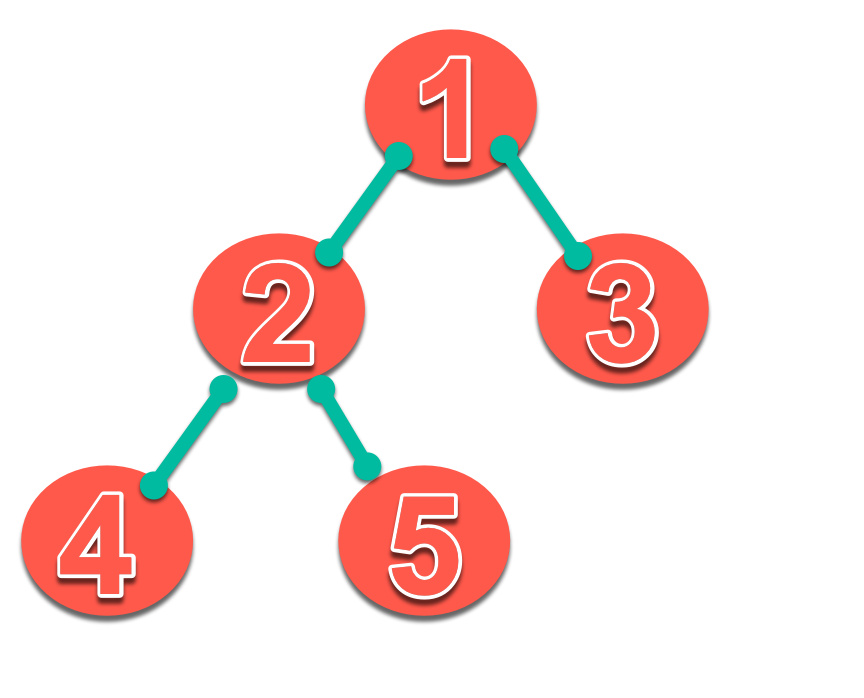
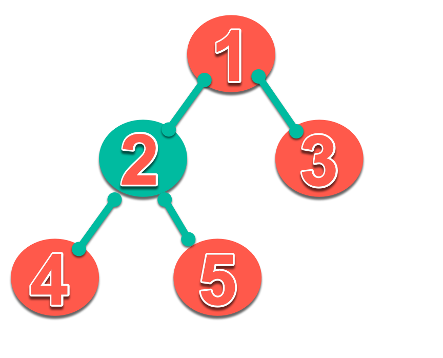
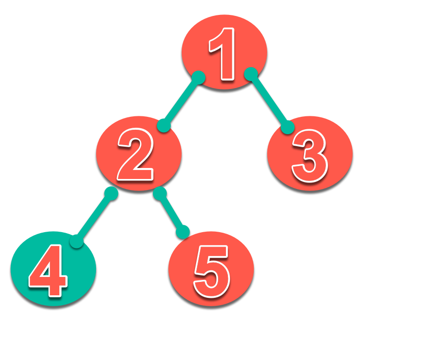

### Lets say we want to convince upper management of an example company to hire new Helpdesk employee(s).

Consider the following Binary Tree as an example:

<div style="text-align:center"></div>

As we can see, the provided tree only have 5 nodes **[1,2,3,4,5]**. How can we transverse i.e. visit each node of the given tree?

An easy way to do that might be recursion.


```python

1 class TreeNode:
2     def __init__(self, val):
3         self.val = val
4       self.left = None
5       self.right = None
6
7  def inorderTraversal(root):
8     answer = []
9
10    inorderTraversalUtil(root, answer)
11    return answer
12
13 def inorderTraversalUtil(root, answer):
14
15    if root is None:
16        return
17    else:
18        print("1).. before left:",answer)
19        inorderTraversalUtil(root.left, answer)
20        print("2).. after left:",answer)
21        answer.append(root.val)
22        print("3).. before right:",answer)
23        inorderTraversalUtil(root.right, answer)
24        print("4).. after right:",answer)
25        print("---------------")
26        return
27
28 root = TreeNode(1)
29 root.left = TreeNode(2)
30 root.right = TreeNode(3)
31 root.left.left = TreeNode(4)
32 root.left.right = TreeNode(5)
33
34 print(inorderTraversal(root))

```

The above code visits each node of the tree and appends the current node to a list called *answer*. Taking a deeper look, we can see how it does that, we will look only at the **interesting** lines of this code:

All starts with line 34 calling *inorderTraversal* function with root as its argument. Please note that root value is **1** here.
Inside *inorderTraversal*, it creates an empty list called 'answer' at line 8 and then goes into *inorderTraversalUtil* at line 10.

Root value is still **1**

<div style="text-align:center"></div>

Goes through lines 13 to 19 prints: **1).. before left:** once because of line 18

At line 19: because of recursion it now passes  **root.left** (i.e. value 2) as an argument to *inorderTraversalUtil* and then again goes from line 13 to 19 printing: **1).. before left:** again because of line 18.

Root value is now **2**
<div style="text-align:center"></div>

At line 19: because of recursion it now passes  **root.left.left** (i.e. value 4) and then again goes from line 13 to 19 printing: **1).. before left:** the third time because of line 18.

Root value is now **4**
<div style="text-align:center"></div>

At line 19: because of recursion it now passes  **root.left.left.left** (i.e. value NULL). It finally sees that our tree does not have any **4.left** value, so it goes from line 13 to 16 and returns nothing.

As expected, it does **NOT** print **1).. before left:** the **4th** time.

Now, finally, it goes into the next line i.e. line 20 and prints **2).. after left:** and appends the **current node (that is 4)** to the empty answer list at line 21.


After organizing and modifying parts of the above graph, we should get something similar to the below example. The below graph uses the same data as the one above.

*Good Graph*

Here, it is much more clearer that we want the reader(s) to approve hiring of 2 new help-desk analysts [Title] as the gap between Received & Processed tickets is gradually increasing since May [Added Annotation].

#### In conclusion, a good graph should:

*	TELL A VISUAL STORY
*	BE EASY TO UNDERSTAND
* BE TAILORED TO YOUR TARGET AUDIENCE
* BE USER-FRIENDLY
* BE HONEST
